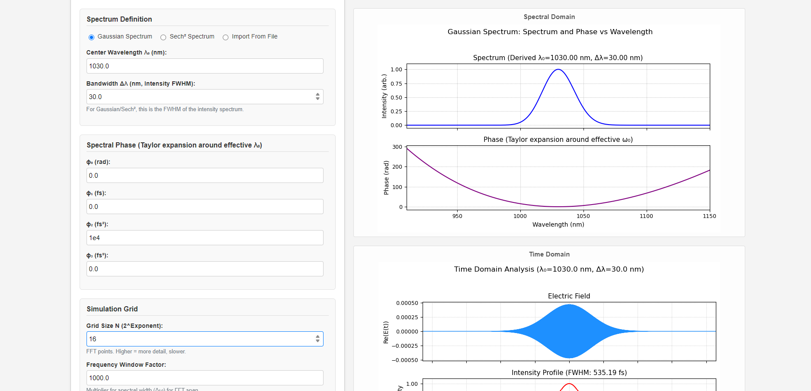

# Pulse Dispersion Analyzer

[](https://opensource.org/licenses/MIT) The **Pulse Dispersion Analyzer** is a web-based quantitative calculator for analyzing ultrashort laser pulses. It allows users to define spectral properties (analytically or via file import) and observe the impact of spectral phase (Group Delay Dispersion - GDD, Third-Order Dispersion - TOD, etc.) on the temporal pulse shape, duration, and other characteristics.

**Live Demo:** [Access the Analyzer Tool Here](https://physicify-simulab.github.io/PulseDispersionAnalyzer/)

## Screenshot



## Overview

The behavior of an ultrashort pulse is fundamentally governed by the Fourier relationship between its temporal and spectral representations. The temporal electric field, $E(t)$, can be determined from its spectral counterpart, $E(\omega)$, which is characterized by a spectral amplitude $A(\omega)$ and a spectral phase $\Phi(\omega)$.

This calculator focuses on the impact of the spectral phase, often described by a Taylor series expansion around the central angular frequency $\omega_0$:

$\Phi(\omega) = \phi_0 + \phi_1(\omega-\omega_0) + \frac{1}{2} \phi_2(\omega-\omega_0)^2 + \frac{1}{6} \phi_3(\omega-\omega_0)^3 + \dots$

Users can adjust these phase coefficients ($\phi_0, \phi_1, \phi_2, \phi_3$) and other parameters to simulate and visualize the resulting pulse characteristics. The application uses Fast Fourier Transforms (FFT) to switch between the spectral and temporal domains.

## Key Features

* **Flexible Spectrum Input:**
    * Define analytical spectra: Gaussian or Sech²[cite: 1].
    * Import experimental data from files (CSV, TXT, DAT) with customizable parsing options (delimiter, skip rows, data transformation)[cite: 1].
    * Optional automatic cropping of imported spectra based on FWHM[cite: 1].
* **Precise Spectral Phase Control:** Adjust Taylor series coefficients:
    * $\phi_0$: Constant phase offset (rad).
    * $\phi_1$: Group delay (fs).
    * $\phi_2$: Group Delay Dispersion (GDD) (fs²).
    * $\phi_3$: Third-Order Dispersion (TOD) (fs³).
* **Comprehensive Outputs & Visualizations:**
    * **Spectral Domain Plot:** Intensity and phase vs. wavelength[cite: 1].
    * **Time Domain Plot:** Real electric field, normalized intensity, temporal phase, and instantaneous frequency vs. time[cite: 1].
    * **Intensity Autocorrelation Plot**[cite: 1].
* **Quantitative Analysis:**
    * Calculation of Full Width at Half Maximum (FWHM) for the temporal pulse intensity[cite: 1].
    * Calculation of FWHM for the intensity autocorrelation[cite: 1].
    * Display of derived effective center wavelength and bandwidth for imported spectra[cite: 1].
* **Simulation Grid Control:**
    * Adjustable FFT grid size (Number of points N as 2<sup>Exponent</sup>)[cite: 1].
    * Configurable frequency window factor for FFT span[cite: 1].
* **User-Friendly Interface:** Interactive controls and clear presentation of results.

## Technologies Used

* **Backend:** Python, Flask [cite: 1]
* **Numerical Computation:** NumPy, SciPy [cite: 1]
* **Plotting:** Matplotlib (server-side, rendered as images) [cite: 1]
* **Frontend:** HTML, CSS, JavaScript
* **File Parsing:** Pandas (for imported spectra) [cite: 1]

## Local Installation and Running

To run the Pulse Dispersion Analyzer locally (e.g., for development or to use unlimited grid sizes for `N_exponent`), follow these steps:

1.  **Prerequisites:**
    * Python 3.7+
    * `pip` (Python package installer)
    * `git` (for cloning the repository)

2.  **Clone the Repository:**
    **Clone the Repository:**
    ```bash
    git clone https://github.com/physicify-simulab/PulseDispersionAnalyzer.git
    cd PulseDispersionAnalyzer
    ```

3.  **Create and Activate a Virtual Environment (Recommended):**
    * On macOS and Linux:
        ```bash
        python3 -m venv venv
        source venv/bin/activate
        ```
    * On Windows:
        ```bash
        python -m venv venv
        .\venv\Scripts\activate
        ```

4.  **Install Dependencies:**
    ```bash
    pip install -r requirements.txt
    ```

5.  **Run the Local Development Server:**
    The `run_local.py` script is configured to run the Flask development server.
    ```bash
    python run_local.py
    ```
    Open your web browser and navigate to the address provided in your terminal (usually `http://127.0.0.1:8050/PulseDispersionAnalyzer/tool` for the calculator or `http://127.0.0.1:8050/PulseDispersionAnalyzer/` for the intro page).

    *Note on Grid Size (`N_exponent`):* The public demo server may have a limit on the `N_exponent` (e.g., up to 22) to conserve resources[cite: 1]. When running locally using `run_local.py` (which sets `APP_ENV=development`), this limit is removed, allowing for larger FFT grids (e.g., `N_exponent` > 22)[cite: 1]. Be mindful of your local machine's memory and processing capabilities for very large values.

## Configuration

* **Default Parameters:** Default values for wavelength, bandwidth, phase coefficients, etc., are defined in `app.py` within the `DEFAULT_PARAMS` dictionary[cite: 1].
* **File Uploads:** Maximum file upload size is configured in `app.py` (`app.config['MAX_CONTENT_LENGTH']`)[cite: 1].
* **N_exponent Limit (Production vs. Local):** The `app.py` file contains logic to enforce a lower `N_exponent` limit when not in a development environment (`APP_ENV` is not 'development')[cite: 1]. This is bypassed when using `run_local.py`, which sets this environment variable appropriately[cite: 1].

## Contributing

Contributions are welcome! If you'd like to contribute, please fork the repository and submit a pull request. For major changes, please open an issue first to discuss what you would like to change.

## License

This project is licensed under the terms of the [MIT License](LICENSE).

## Acknowledgements

* **Original Author:** Hussein-Tofaili ([GitHub Profile](https://github.com/Hussein-Tofaili))
* This project is maintained by [Physicify SimuLab](https://github.com/physicify-simulab).

